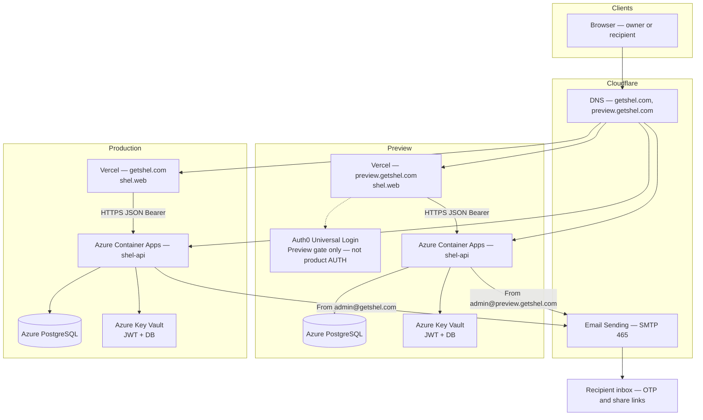

# SHeL hosted architecture

Product rules stay in [`shel.design.md`](https://github.com/adadevoh/shel/blob/main/shel.design.md). This file is the hosted stack a professional can take as “this is how SHeL is wired.”

Split origin: the SPA is on Vercel; product HTTP is on Azure. Preview and Production are two full stacks — they do not share a database, JWT, CORS origin, or mail From.

## Runtime path

Browser → Cloudflare DNS → Vercel (`shel.web`) → Azure Container Apps (`shel-api`) → Azure PostgreSQL. Mail leaves the API through Cloudflare Email Sending. Auth0 is a Preview-only SPA gate, not product AUTH.

Software layering inside the SPA and API (pages → session → HTTP → Minimal API → Postgres) is [`shel.design.md` §4](https://github.com/adadevoh/shel/blob/main/shel.design.md#4-system-architecture).

## DNS (Cloudflare)

Cloudflare holds the zone. SPA names go to Vercel; API names go to Azure Container Apps.

| Name | Role | Points at |
| --- | --- | --- |
| `getshel.com` | Production web `{webOrigin}` | Vercel |
| `preview.getshel.com` | Preview web `{previewWebOrigin}` (stable hostname, not a per-PR URL) | Vercel |
| Production API custom domain | `{apiOrigin}` | Azure Container Apps |
| Preview API custom domain | `{previewApiOrigin}` | Azure Container Apps |

## Identity and mail

Product login is first-party OTP to email, then a JWT bound to a Session row in Postgres. No retained password. CORS allowlists that environment’s web origin only. The Bearer token lives in the SPA (`localStorage`), not cookies. Routes stay on `shel-api`: `/auth/…` and `/events/…`.

Auth0 Universal Login may wrap the Preview SPA when `VITE_AUTH0_DOMAIN` and `VITE_AUTH0_CLIENT_ID` are set. Unset env leaves local, tests, and Production unchanged. Auth0 is not the User or Session store.

`shel-api` sends OTP and share-link mail over SMTP (implicit TLS, port 465) through `smtp.mx.cloudflare.net`. From is locked per environment: `admin@preview.getshel.com` (Preview), `admin@getshel.com` (Production), `dev@getshel.com` (Development). Tests and CI do not send.

## Release path

GitHub is the source of truth. Production deploys only from `main` after tests and secret scan. Preview deploys do not use Production secrets. Vercel must never receive `Jwt__Key` or the database password — the SPA only sees that environment’s API origin.

| Piece | How it ships |
| --- | --- |
| `shel.web` | Vercel Git integration; Preview vs Production env, each with its own `apiBaseUrl` |
| `shel-api` | GitHub Actions builds a Docker image, pushes Azure Container Registry, updates the Container App |
| Postgres schema | Explicit EF migrate job before the new API revision serves traffic — not on API startup hosted |
| Secrets | Azure Key Vault → Container App secret refs (`Jwt__Key`, connection string) |

## Not this stack

Android (local-first), Hangfire scheduler, Redis session cache, SendGrid, and Twilio are later. Sessions stay in Postgres. Do not treat those as the running system.
